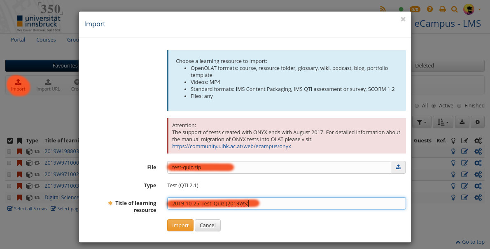

```{r, include = FALSE}
suppressPackageStartupMessages(library("exams"))
```


This vignette describes how to get started using the _R_
exams package to create randomized OLAT tests (or quizzes).
Several tutorials are available on [r-exams.org][rexamstutorials]
which also help beginners with getting used to the features
of the _R_ exams package.

The following tutorials might be of interest:

* [First Steps][rexams-firststeps]
  a first overview of the structure of [R/exams][rexams].
* [Stress Testing Dynamic R/exams Exercises][rexams-stress]
  automatic stress-test of randomized exercises.


# Start to write R/exams questions

[R/exams][rexams] questions are written in either pure markdown (`.md`),
R/markdown (`.Rmd`) or R/LaTeX using [Sweave][sweave] (`.Rmd`). 
For demonstration purposes this tutorial is only using R/Markdown
files, more information can be found in the ["First Steps"][rexams-firsteps]
tutorial on [r-exams.org][rexams].

## Write your first static question

To create a new question we write a new `.Rmd` file and edit
the content with a text editor, e.g., a file called `iso3-code.Rmd`.
The following output shows the content of this file (`iso3-code.Rmd`)
which contains a simple 'static' single choice [R/exams][rexams] question:

```{r, results = "markdown", echo = FALSE, comment = ""}
cat(paste(readLines("iso3-code.Rmd"), collapse = "\n"))
```

Each question consists of three sections, namely
"Question", "Solution", and "Meta-information".

* "Question": contains the question itself, simply text which
  contains the task. The "Answerlist" subsection defines the
  possible answers (here 3).
* "Solution": this is typically not shown to the participants,
  or only depending on the system settings (e.g., if the 'solutionswitch'
  in OpenOLAT is enabled). Can contain text with an extensive solution
  if needed, and contains a subsection "Answerlist" **in the same order**
  as the possible answers in the "Question" section.
* "Meta-information": contains the name and type of the question,
  information about the correct solution, and additional settings.
  In this case it is a single choice question (`extype: schoice`),
  `exsolution` defines the correct answer. Three possible answers,
  the first one is correct (thus `100`). `exshuffle: True` tells 
  [R/Exams][rexams] to shuffle the possible questions (3 out of 3;
  random order).

### Testing the question

Once we have saved our file (`iso3-code.Rmd`) we can test the
question by calling:

```r
# Renders the question as html
exams2html("iso3-code.Rmd")
```

This will open the html-rendered version of the question in your browser.  As
`exshuffle` is turned on you will get a different randomization every time the
command above is called. **It is suggested** to do this multiple times to see
if the randomization works as expected.

### Testing the solution

The function `exams_metainfo()` allows to check/test if the solution
defined in the Meta-information section is specified correctly.

```{r, include = FALSE}
set.seed(100)
```

```{r}
# Test solutionstring
exams_metainfo(exams2html("iso3-code.Rmd"))
```

The output shows the correct answer is "**2**" which can be compared
with the rendered html output (not shown here) to see if it is correct.

### Stress-testing the question

Once one has checked that the randomization works, the texts are
correct, and the answer is correct a stress-test for the question
can be done by calling `stresstest_exercise()`.

`stresstest_exercise()` renders the exercise multiple types (100 times
by default) and returns some information about the randomization.

```{r, results = "hide", fig = TRUE, fig.width = 7, fig.height = 5}
# Stresstesting 'iso3-code.Rmd' (100 times)
stress <- stresstest_exercise("iso3-code.Rmd")
plot(stress)
```

The output shows the runtime to generate the randomized questions
and the position of the correct solution. As we use `exshuffle: True`
with three possible answers this should be close to a uniform distribution
between 1, 2, and 3.


## Write our first dynamic question

[R/exams][rexams] questions can also be dynamic.  The following example is the
content of a second question stored in `vector-subsetting.Rmd`.


```{r, results = "markdown", echo = FALSE, comment = ""}
cat(paste(readLines("vector-subsetting.Rmd"), collapse = "\n"))
```

### Testing the question/solution

Again, it is recommended to check the question multiple times
by calling:

```r
# Test html output and meta information (correct answer)
exams_metainfo(exams2html("vector-subsetting.Rmd"))
```

### Stress-testing

In contrast to the static single choice exercise this exercise
uses a randomized vector `x`, randomized vector indices (`idx`), and
randomized correct values (`res`). Thus, in addition to the 'runtime',
'position of correct solution' and 'rank of correct solution'
the function also returns the values of all scalars (here `idx`, `res`)
of all randomizations during the stress test.


```{r, results = "hide"}
# Run the stresstest
stress <- stresstest_exercise("vector-subsetting.Rmd")
# Plot overview
plot(stress)
```

The additional information stored on `stress$objects` can be
used to get more insights, e.g., how often each index `idx` $\in {1, ..., 5}$
has been chosen and what the correct answers were (`res`):

```{r, fig = TRUE, fig.width = 7, fig.height = 3}
# Plot histograms of the two scalars idx/res from the
# 100 randomizations performed by the stresstest function
par(mfrow = c(1, 2), mar = c(5, 5, 2, 1))
hist(stress$objects$idx, col = "gray90",
     breaks = seq(0.5, 5.5, by = 1),
     main = "Histogram of idx")
hist(stress$objects$res, col = "gray90",
     main = "Histogram of res")
```


# Generate OLAT Test for Upload

Once the questions have been tested and approved we can create
the final test used to upload to OpenOLAT. This is done by calling
the `exams2openolat()` function. The first input can be a single
file (e.g., `iso3-code.Rmd`; results in a test with only one question)
or a list of files. Each entry of the list contains the name of one
`.Rmd` file and corresponds to one question in the quiz.
If the list entry contains a character vector with multiple file names,
[R/exams][rexams] will _chose one of the files provided_ to generate
the question (allows for additional randomization of questions).

Note: `exams2openolat()` has a wide range of additional input arguments
to adjust/control the test settings (see [R/exams][rexams]).
To generate the zip archive file for OpenOLAT we have to call the
following:

```{r}
# Set seed (makes the randomization reproduceable
set.seed(321)
# Generate OpenOLAT test/exam resource
exams <- exams2openolat(file = list("iso3-code.Rmd", "vector-subsetting.Rmd"),
                        n = 3L, dir = ".", name = "test-quiz",
                        maxattempts = 100L)
# Save the generated tests for evaluation
saveRDS(exams, file = "test-quiz.rds")
```

* `file`: the files with the questions to be converted.
* `n`: number of randomized tests to be generated. Default is `n = 1L`.
    If you create `n = 10L` tests for 50 participants each test might
    be re-used about 5 times (`n` does not limit the number of participants).
* `name`: name of the test (will generate `<name>.zip` as output file;
    default is \code{"olattest"}).
* `maxattempts`: number of attempts - number of times the participants
    are allowed to change the selected answer. Default is only 1
    (`maxattempts = 1L`).
* **Return**: returns a list with questions/answers.

**Note**: it is very important to store the `exams` object with the
randomized questions/answers if one wants to evaluate the tests later on!
It is also highly recommended to **set a seed** for pseudo-randomization.
This allows to reproduce the generated tests if the `.rds` file gets lost.

The function call `exams2openolat()` creates the output zip archive
file `test-quiz.zip` used to import the test on the OpenOLAT learning
management system.


# Upload test to OpenOLAT

Once the test has been generated one can import the tests to OpenOlat.
To do so, log in to OpenOLAT and go to the **Authoring** section.
The zip file (`test-exam.zip`) can be uploaded via the **Import** button:

```{r img import, echo = FALSE, fig.out = "70%", fig.align = "center"}

```

It is highly **recommended** to give the learning resource a clear and
unique title such that one can easily find the resource later on.
Once the test has successfully been imported a new course element has to
be created. First, navigate to your course in OpenOLAT and enter the
**Administration** area. Afterwards there are two options:

* Create a new course element of type **Test**,
* or copy an existing **Test** course element.

The latter option has the advantage that it also copies the settings of
the course element! To 'attach' the uploaded learning resource select
the course element, click on **Test configuration** and **select**
or **replace** (in case you made a copy of an existing test course element)
the 'file' (the uploaded test/zip file).

Note: check and adjust all test settings from Title and description,
accessibility, and course element options!


